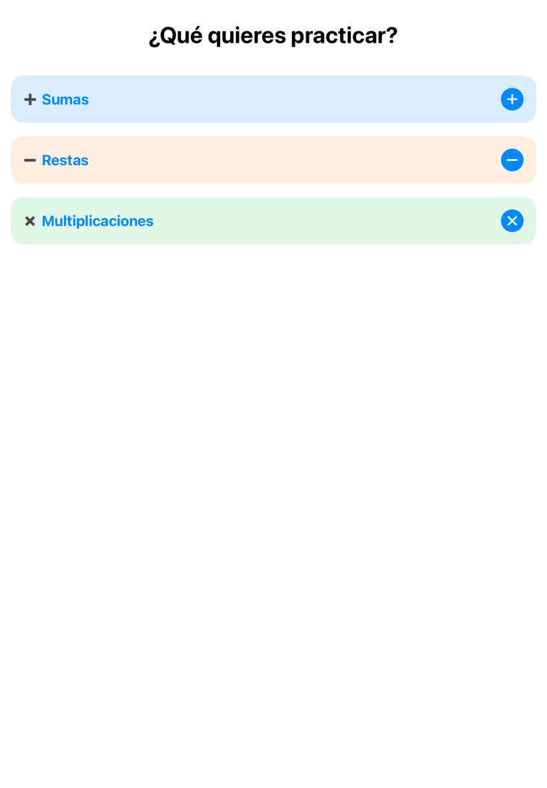
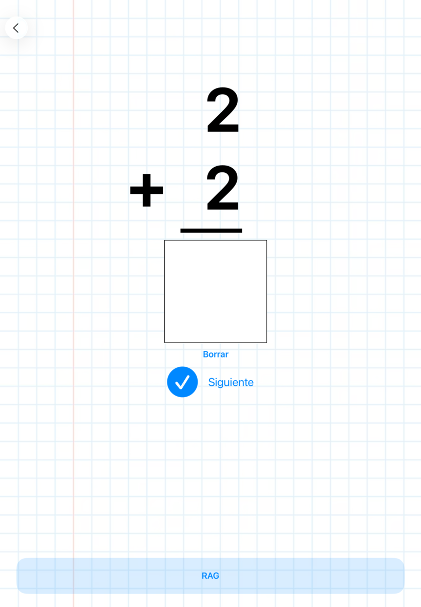
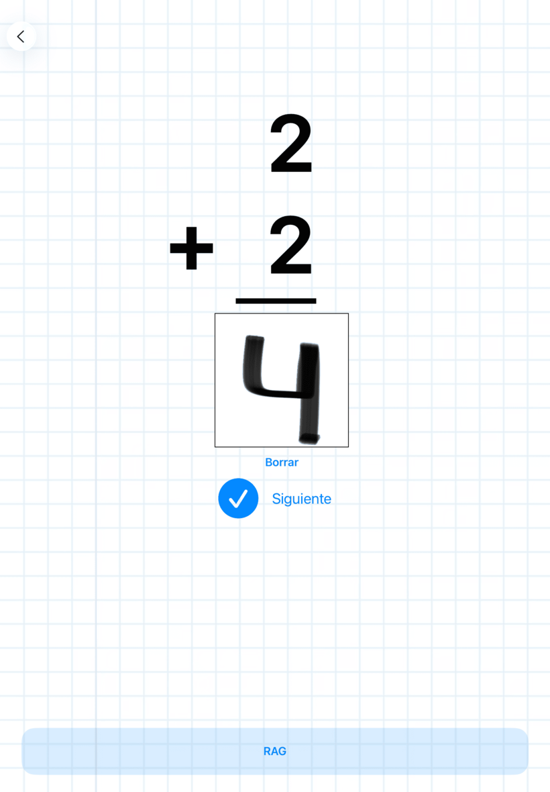
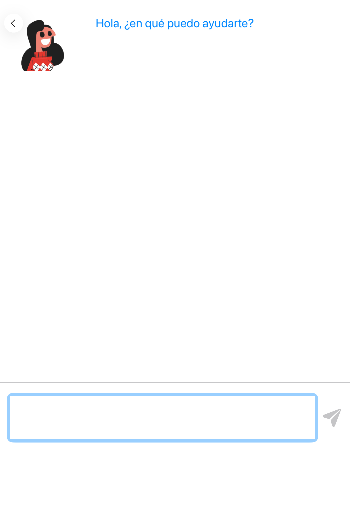
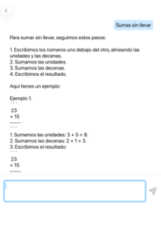

# 📘 AulaWrite — README con Capturas y Explicación Completa

AulaWrite es una aplicación educativa creada en **SwiftUI**, diseñada para que el alumnado de Primaria practique operaciones matemáticas mientras interactúa con un **asistente inteligente RAG** y un **reconocedor de dígitos escritos a mano**.

---

# 🖼️ Capturas del Proyecto  

## 🚀 Pantalla de selección


## 📱 Pantalla Principal (OperationView)




## ✍️ Lienzo para escribir dígitos (Canvas)


## 🤖 Asistente Inteligente RAG




---

# 🧱 Tecnologías principales

### 📱 iOS (Frontend)
- SwiftUI  
- PencilKit (canvas)  
- CoreML (modelo de dígitos)  
- AVFoundation (audio TTS)  
- NavigationStack

### 🤖 Backend RAG (Python)
- FastAPI  
- OpenAI GPT-4o-mini  
- SQLite  
- Numpy + embeddings  
- Gradio (versión web)

---

# 🔢 **Reconocimiento de Dígitos – Dos Modelos Integrados**

AulaWrite incluye **dos motores de reconocimiento de dígitos**:

---

## **1️⃣ MNISTClassifier.mlmodel (Apple CoreML)**  
Modelo preentrenado oficial de Apple integrado en Xcode.  
Muy robusto, rápido y optimizado para dispositivos iOS.

---

## **2️⃣ modelo_digitos.mlpackage (Modelo propio entrenado en Python con Keras)**  
Este modelo fue entrenado usando:

```python
model = keras.Sequential([
    keras.Input(shape=input_shape),
    layers.Conv2D(32, (3,3), activation="relu"),
    layers.MaxPooling2D(2,2),
    layers.Conv2D(64, (3,3), activation="relu"),
    layers.MaxPooling2D(2,2),
    layers.Flatten(),
    layers.Dense(128, activation="relu"),
    layers.Dense(10, activation="softmax")
])
```

Se entrenó sobre:

- MNIST clásico  
- Más datos generados desde la app  
- Inversión, normalización y expansión del dataset  

Luego se convirtió a **.mlpackage** para utilizarse directamente en iOS.

📌 **El usuario puede elegir entre ambos modelos o fusionar su lógica para mayor precisión.**

---

# ✍️ ¿Cómo se transforma el dibujo en un dígito?

1. El alumno escribe usando PencilKit  
2. La imagen se recorta y procesa  
3. Se reescala a 28×28  
4. Se convierte a escala de grises  
5. Se invierte (fondo blanco, número negro)  
6. Se genera un `CVPixelBuffer`  
7. El modelo CoreML predice el dígito  
8. La app compara con el resultado correcto

---

# 🧠 Asistente Inteligente (RAG)

El asistente permite al alumno preguntar:

> “Explícame cómo sumar llevando”  
> “No entiendo esta multiplicación”  

## Flujo RAG completo:

1. SwiftUI envía la pregunta al backend  
2. FastAPI recupera documentos relacionados desde SQLite  
3. Construye un prompt educativo (profesora de Primaria)  
4. GPT‑4o‑mini genera una explicación adecuada  
5. Se devuelve a la app:  
   - `answer` (texto)  
   - `video_url`  
   - `audio_url` (si está activado TTS)

---

# 🎥 Vídeos educativos integrados

Los vídeos están organizados por tópico dentro de:

```
assets/videos/
```

El sistema elige automáticamente el mejor vídeo según:

- tema  
- palabras clave  
- coincidencias semánticas  

---

# 🎧 Integración de Audio TTS

### ✔ Opción 1: AVSpeechSynthesizer (SwiftUI)  
Fácil y sin coste.

### ✔ Opción 2: OpenAI TTS (FastAPI)  
Voz natural estilo humana.

---

# 📂 Estructura del Proyecto

```
AulaWrite/
├── AulaWriteApp.swift
├── OperationView.swift
├── RAGChatView.swift
├── CanvasView.swift
├── DigitRecognizerView.swift
├── AppleDigitRecognizer.swift
├── modelo_digitos.mlpackage
├── Assets.xcassets/
└── Screenshots/          
```

---

# 🔧 Instalación

## iOS App
1. Clonar repositorio  
2. Abrir en Xcode  
3. Ejecutar en simulador o dispositivo  

## Backend RAG

```bash
uvicorn api:app --reload --host 127.0.0.1 --port 8000
```

---

# 📄 Licencia  
MIT
